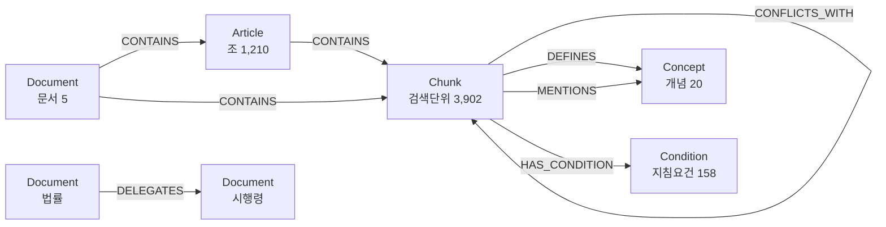

# Legal GraphRAG 학습 노트 (교과서용)

> 이 문서는 "그래프 RAG가 뭔지도 잘 모르는" 상태에서 출발해, 우리 프로젝트가 왜 그래프를
> 선택했고 어떻게 설계했는지를 **개념 중심**으로 따라갈 수 있게 만든 학습 자료다. 코드는
> 최소화하고, 원리·비유·설계 논리에 집중한다. (구현 세부는 `guide.md`·`data/graph_schema.md` 참조)

---

## 0. 우리 프로젝트 한 문장 요약

> **5개의 한국 고용·세제 법령 문서를 "지식 그래프"로 엮어, 여러 문서를 넘나들며(멀티홉)
> 답을 찾고, 문서 간 기준이 충돌하는 지점까지 짚어내는 질의응답 시스템을 만든다.**

5개 문서:

| 약칭 | 정식 | 성격 |
|------|------|------|
| 조특법 | 조세특례제한법 | 법률 (세액공제 등 혜택의 근거) |
| 조특령 | 조세특례제한법 시행령 | 시행령 (조특법의 세부 기준) |
| 고보령 | 고용보험법 시행령 | 시행령 (고용보험·지원금 기준) |
| 근기령 | 근로기준법 시행령 | 시행령 (근로자 산정 등 노동 기준) |
| 지침 | 청년일자리도약장려금 사업지침 | 행정지침 (실제 지원금 집행 규칙) |

---

## 1. 먼저 RAG부터: 검색을 붙인 LLM

### 1.1 LLM 혼자서는 왜 부족한가

ChatGPT 같은 대규모 언어모델(LLM)은 말은 잘하지만 세 가지 약점이 있다.

1. **환각(hallucination)**: 모르면서도 그럴듯하게 지어낸다. 법령처럼 "틀리면 안 되는" 영역에서 치명적.
2. **최신성**: 학습 시점 이후의 개정·신설 법령을 모른다.
3. **출처 부재**: "그렇게 답한 근거가 어느 조문인지"를 댈 수 없다.

법률 도메인에서는 "정답"보다 "**어느 조문 때문에 그런 답인지**"가 더 중요하다. 그래서 LLM에게
관련 원문을 먼저 찾아 쥐여주고 답하게 하는 방식이 필요하다.

### 1.2 RAG의 기본 아이디어

**RAG(Retrieval-Augmented Generation, 검색증강생성)** = "검색"을 먼저 하고 그 결과를 LLM에
"증강(맥락 주입)"해서 답을 "생성"하는 구조다. 흐름은 단순하다.

```
질문 → (1) 관련 문서 조각 검색 → (2) 그 조각을 프롬프트에 넣어 LLM에 전달 → (3) 근거 기반 답변
```

비유하자면, LLM은 똑똑하지만 기억에만 의존하는 변호사이고, RAG는 그 변호사에게 **답하기 전에
관련 법전 페이지를 펼쳐 주는 사서**다. 사서가 좋은 페이지를 찾아줄수록 답이 정확해진다.

### 1.3 "검색"은 어떻게 하나 — 임베딩과 의미 유사도

키워드 검색(Ctrl+F)은 글자가 똑같아야 찾는다. 하지만 "상시근로자 수 계산"과 "근로자 인원 산정
방식"은 글자는 달라도 뜻이 같다. 이를 잡으려면 **임베딩(embedding)**을 쓴다.

- 임베딩 = 문장을 **의미를 담은 숫자 벡터**(예: 1536차원의 좌표)로 바꾸는 것.
- 뜻이 비슷한 문장은 이 좌표 공간에서 **가까이** 위치한다.
- 따라서 "질문 벡터와 가장 가까운 문서 벡터"를 찾으면 = 의미적으로 가장 관련 있는 원문을 찾는 것.

이것이 **벡터 검색(semantic search)**이다. RAG의 표준 검색 방식이다.

### 1.4 그런데 일반 RAG(벡터 검색만)의 한계

벡터 검색은 "질문과 닮은 한 조각"은 잘 찾지만, 다음을 못 한다.

1. **관계를 모른다**: "이 조항이 인용하는 다른 조항"을 따라가지 못한다. 닮은 조각만 가져온다.
2. **멀티홉(multi-hop)에 약하다**: 답이 한 조각에 다 없고 "A 조항 → A가 가리키는 B 조항 →
   B가 정의한 C 개념"처럼 **여러 단계를 거쳐야** 완성되는 질문에 약하다.
3. **충돌을 못 본다**: 같은 단어를 다르게 정의한 두 문서를 각각 잘 찾아오더라도, 그 둘이
   **서로 모순**이라는 사실 자체는 알려주지 못한다.

법령 질의는 정확히 이 세 가지를 요구한다. 그래서 그래프가 등장한다.

---

## 2. GraphRAG란 무엇인가

### 2.1 지식 그래프 = 점과 선으로 만든 지도

**지식 그래프(knowledge graph)**는 세상을 두 가지로 표현한다.

- **노드(Node, 점)**: 사물·개념. 예) "제26조의8", "상시근로자", "조특법시행령".
- **엣지(Edge, 선)**: 노드 사이의 **관계**. 예) "제26조의8 — (정의함) → 상시근로자",
  "조특령 §26 — (인용함) → 조특법 §29".

벡터 검색이 "닮은 문서를 한 무더기" 주는 것이라면, 그래프는 **"이 조항과 연결된 것들이 무엇인지"를
지도처럼** 보여준다. 도서관 비유를 이어가면: 벡터 검색은 "비슷한 책 찾기"이고, 그래프는 "이 책이
참고한 책, 이 책이 정의한 용어, 이 용어를 다르게 쓰는 다른 책"까지 이어진 **인용 지도**다.

### 2.2 GraphRAG = 벡터 검색 + 그래프 탐색

**GraphRAG**는 둘을 결합한다.

```
질문 → (1) 벡터 검색으로 '출발 지점' 조각을 찾고
     → (2) 그래프의 엣지를 따라 '연결된 조항·개념·충돌'까지 확장 수집
     → (3) 모은 맥락 전체로 LLM이 근거 기반 답변
```

핵심은 (2)다. 벡터 검색이 찾은 한 조각을 **출발점(entry point)**으로 삼아, 그래프 위를 걸어다니며
관련 조항을 모은다. 이 "걸어다니기"가 멀티홉을 가능하게 한다.

### 2.3 GraphRAG가 강한 세 가지 지점 (일반 RAG와 대비)

| 능력 | 일반 RAG | GraphRAG |
|------|----------|----------|
| 닮은 조각 찾기 | O | O (동일하게 벡터 사용) |
| 인용 따라가기 | X | **O** (REFERENCES 엣지로 추적) |
| 멀티홉 추론 | 약함 | **강함** (엣지를 여러 번 타고 이동) |
| 충돌 드러내기 | X | **O** (CONFLICTS_WITH 엣지로 명시) |
| 근거 추적성 | 조각 단위 | **조항·관계 단위** (왜 이 조항인지 경로로 설명) |

> 정리: GraphRAG는 "검색"에 "구조"를 더한 것이다. 문서가 서로 **촘촘히 얽혀 있을 때** 진가를 발휘한다.

---

## 3. 왜 "이" 데이터셋에 그래프가 유리한가

법령은 GraphRAG에 거의 이상적인 데이터다. 이유를 우리 5개 문서로 구체화해 보자.

### 3.1 법령은 본질적으로 "참조 덩어리"다

법조문은 끊임없이 다른 조문을 인용한다. "제29조의8제1항에 따른 상시근로자", "「근로기준법」에
따라" 같은 식이다. 우리 데이터에서 **참조를 추출했더니 6,825건(코퍼스 내부에서 해소 가능한 것만)**
이 나왔다. 즉 문서가 본래 그래프처럼 생겼다. 이걸 평평한 텍스트로만 다루면 그 연결을 통째로 버리는 셈이다.

### 3.2 법은 "위임 위계"를 갖는다 (법률 → 시행령 → 지침)

- **법률**(조특법)이 큰 원칙과 혜택을 정하고,
- **시행령**(조특령)이 그 세부 기준("상시근로자란 …")을 정하고,
- **행정지침**(장려금지침)이 실제 집행 규칙(요건·금액·중복 여부)을 정한다.

답 하나가 이 **세 층을 모두 거쳐야** 완성되는 경우가 많다. 이것이 멀티홉의 원천이며, 위계 자체가
그래프의 CONTAINS/DELEGATES 엣지로 자연스럽게 표현된다.

### 3.3 같은 단어, 다른 정의 → "충돌"이 실재한다

가장 중요한 포인트다. **"상시근로자", "청년", "단시간근로자"** 같은 핵심 개념이 문서마다 다르게
정의된다. 우리 분석에서 **20개 개념 중 17개가 2개 이상 문서에 걸쳐** 등장했고, 자동 후보(70쌍)를
거른 뒤 **정준 조문에 앵커링한 기준 충돌 7건**을 확정했다. 여기서 핵심은 *조문 번호와 "무슨 판단을
위한 기준인지(용도)"를 정확히 구분*하는 것이다 — 같은 숫자라도 용도가 다르면 다른 조문이다.

- **상시근로자 수 산정식**: 근기령 §7의2는 "한 달 연인원 ÷ 가동일수"(근로기준법 적용범위 판단용),
  조특령 §26의8은 "매월 말일 인원 평균 + 계약 1년 미만·월 60시간 미만·임원·최대주주 친족 제외"
  (세액공제 대상 산정용). → 같은 회사라도 **목적에 따라 인원 수가 달라진다.** 한 수치를 다른 신청서에
  재사용하면 틀린다.
- **단시간근로자 — 조문·용도 구분 주의**: "월 60시간 이상 0.5명, 미만 제외"는 고용보험법시행령
  **§12⑤(우선지원대상기업 *규모* 판정용)**이다. 반면 단시간 근로자를 **피보험자에서 제외**하는 기준은
  같은 법의 **§3①(주 15시간 또는 월 60시간 미만, *피보험자 자격*용)**으로 *조문도 용도도 다르다.*
  세법은 조특령 §26의8②2호가 월 60시간 미만을 상시근로자에서 제외한다. → 셋은 "단시간"을 다루지만
  **무엇을 판단하려는지가 제각각**이다.
- **기간제·계약기간** (정정): 근기령은 기간제를 **포함**(§7의2④, 고용형태 불문)한다. 다만 **조특령은
  "기간제라서" 제외가 아니라 "계약 1년 미만이라서" 제외**(§26의8②1호)다 — *계약 1년 이상 기간제는
  조특령도 포함*한다. "기간제 제외"라고 뭉뚱그리면 틀린 정보가 된다.
- **청년 연령**: 고용보험법시행령 §17(고용촉진)은 **15~34세**, 조특령 §81(중소기업 취업 청년
  소득세 감면)은 15~34세에 **군복무기간(최대 6년) 차감**을 둔다. → 제도마다 기준선과 산정이 다르다.
  ⚠️ 장려금 **지침**의 청년 참여연령 세부(예: 군필 가산 39세 등)는 **지침 원문 대조가 아직 안 된**
  LLM 추출값이므로, 검증 전에는 사실로 단정하지 않는다(`verified=false`).
- **피보험자 수 ↔ 상시근로자 수**(역할 등가 충돌): 장려금은 "고용보험 피보험자 수"로, 세액공제는
  "세법 상시근로자 수"로 같은 인력을 다르게 집계한다 → 장려금 신청 인원을 세액공제에 전용할 수 없다.

> 💡 **"충돌이 7건뿐"은 약점이 아니라 발견이다**: 핵심이 충돌인데 7건이면 적어 보일 수 있다. 하지만
> 이는 *나쁜 결과가 아니라 데이터가 말해주는 사실*이다 — **한국 노동·세법은 생각보다 잘 정렬돼 있어
> 진짜 기준 충돌은 희소하다**(개념 17종이 멀티문서에 걸쳐 있어도, 정말로 동일 사안에 다른 기준을
> 들이대는 경우는 드물었다). 가치는 "충돌이 많다"가 아니라 **"그 희소한 충돌을 정확히 짚어내고, 정렬돼
> 있는 나머지는 헛경보를 내지 않는다"**에 있다. (그래서 평가셋에 distractor 음성표본이 있다 — §7.5)

> ⚠️ **방법론 메모(정직한 기록)**: 위 7건은 자동 후보를 LLM으로 *2차 확정*하려 했으나, "같은 지표를
> 다른 목적으로 산정"하는 경계(예: 고보 §12 규모판정 vs 세법 §26의8 산정)에서 LLM 판정이 루브릭
> 표현에 따라 **1건↔25건으로 진동**했다. 그래서 LLM은 후보 생성 보조로만 쓰고, **최종 엣지는 정준
> 조문에 직접 앵커링**해 확정했다(QA 정답은 여전히 미참조). 정밀한 충돌 식별은 도메인 검증이
> 필요하다는 것이 이번 작업의 솔직한 발견이다.

이런 충돌은 평평한 검색으로는 절대 "드러나지" 않는다. 사용자가 각각 따로 물어보면 각각 맞는 답을
주지만, **"둘이 다르다"는 사실**은 아무도 말해주지 않는다. 그래프는 이 둘을 CONFLICTS_WITH 엣지로
직접 이어서 **모순을 1급 시민으로** 다룬다. 이것이 본 프로젝트가 그래프를 쓰는 핵심 명분이다.

### 3.4 멀티홉 질문 예시 (왜 한 조각으로는 안 되는가)

> 질문: "중소기업이 만 30세 청년을 정규직으로 채용하면 통합고용세액공제를 받을 수 있나? 그리고
> 청년일자리도약장려금과 중복해서 받을 수 있나?"

답을 만들려면 이런 경로를 걸어야 한다.

```
[지침] 도약장려금 중복지원 규정 + 청년/근로조건 요건
   │
   ▼ (REFERENCES / 개념 연결)
[조특법 §29의8] 통합고용세액공제의 근거
   │
   ▼ (DELEGATES: 법률이 시행령에 위임·구체화)
[조특령 §26의8] '상시근로자·청년등상시근로자'의 정의
   │
   ▼ (CONFLICTS_WITH)
[근기령 §7의2] 상시근로자 산정식 (조특령과 기준이 다름)
```

한 조각(chunk)에는 이 정보가 흩어져 있어 다 담기지 않는다. **엣지를 타고 4개 문서를 이동**해야
비로소 "받을 수 있고, 다만 청년 정의/인원 산정 기준이 제도마다 다르니 주의" 같은 완전한 답이 된다.
이것이 그래프가 유리한 이유의 결정판이다.

---

## 4. EDA: 왜 했고, 무엇을 봤는가

### 4.1 EDA의 목적 — "설계를 감이 아니라 데이터로 정한다"

EDA(탐색적 데이터 분석)는 그래프를 짓기 전에 **데이터의 실제 모양을 측정**해서, 청킹 크기·노드
종류·엣지 종류를 **추측이 아니라 근거로** 결정하기 위한 단계다. 우리는 다섯 가지를 측정했다.
(전부 외부 API 없이 로컬에서 수행 — 결과는 `eda_report.md`에 기록)

### 4.2 측정 1 — 항(項)별 토큰 분포 → "청크를 얼마나 크게 자를까"

- **무엇을**: 각 조문을 '항' 단위로 쪼갠 뒤 길이(토큰 수) 분포를 봤다.
- **결과**: 법령은 항당 중앙값 120~165토큰으로 **대체로 짧았다.** 일부 정의 조항만 매우 길었다.
- **그래서**: "항을 그대로 청크로" 쓰면 너무 잘게 쪼개져 맥락이 끊긴다. → **300토큰 미만이면 같은
  조 안에서 인접 항과 합치고, 1500토큰을 넘으면 호(號) 단위로 나눈다**는 규칙을 도출했다.
  (지침의 별첨 표는 한 덩어리가 11만 토큰까지 갔다 → 페이지+토큰 상한으로 분할)

### 4.3 측정 2 — 참조의 양과 "해소 가능성" → "REFERENCES 엣지를 어떻게 만들까"

- **무엇을**: 모든 "제N조" 인용을 찾아, 그게 **어디를 가리키는지** 분류했다.
- **결과**: 참조를 세 종류로 나눴다.
  - **internal(4,814건)**: 자기 문서 안의 다른 조항.
  - **cross_corpus(2,011건)**: 우리가 가진 다른 문서를 가리킴 — **거의 전부 조특령 → 조특법.**
  - **external(774건)**: 「국세기본법」 등 **우리가 안 가진 법**을 가리킴(dangling).
- **그래서**: 코퍼스 안에서 실제 연결되는 곳(조특법↔조특령)에만 엣지를 만들고, 외부 참조는
  **엣지로 만들지 않고 속성으로만 보존**한다(없는 노드로 가는 끊긴 선을 만들지 않음 = 그래프 오염 방지).

> **이 수치가 설계에 주는 결정적 함의 (꼭 알 것)**: cross_corpus 2,011건은 **100%가 조특법시행령 →
> 조특법** 한 쌍에 몰려 있다(고보·근기·지침 사이, 그리고 이들↔조특 사이의 직접 참조는 **0건**).
> 이는 곧 **"인용(REFERENCES)만으로는 조특 외 문서끼리 절대 이어지지 않는다"**는 뜻이다. 그런데
> 우리 QA의 충돌 상당수는 *고보령 vs 조특령*(단시간), *근기령 vs 조특령*(산정식)처럼 **문서 간**
> 비교다. → 따라서 우리의 멀티홉은 **두 종류**로 갈린다.
> - **참조 기반 홉** (조특법↔조특령): REFERENCES 5,561 엣지가 받친다 — Q3·Q7(연쇄추징) 같은 hop3.
> - **개념 기반 홉** (고보·근기·지침↔조특): REFERENCES가 없으니 **Concept 노드 + CONFLICTS_WITH/
>   DEFINES**가 유일한 다리다 — Q1·Q2 같은 문서 간 기준 비교.
>
> **이것이 Concept 레이어(원문엔 없던 노드를 분석으로 얹은 것)의 존재 이유 그 자체다.** "멀티홉이라며
> 왜 참조가 한 쌍에 몰렸냐"는 날카로운 질문에 대한 답이 바로 "참조로 못 잇는 문서는 개념이 다리를
> 놓기 때문"이다. (→ §5.2에서 다시 연결)

### 4.4 측정 3 — 개념 빈도와 "문서 간 중첩" → "충돌 후보가 어디 있나"

- **무엇을**: 핵심 개념 20종이 문서별로 몇 번, 어디에 나오는지 셌다.
- **결과**: **17개 개념이 2개 이상 문서에 동시 등장**. 이 17개가 곧 "충돌이 일어날 수 있는 모집단"이다.
- **그래서**: 충돌 탐지를 17개 멀티문서 개념에 집중하면 됨을 알았다.

### 4.5 측정 4 — 정의문 위치 → "DEFINES 엣지와 충돌의 핵심 지점"

- **무엇을**: "~란 …을 말한다", "~의 범위" 같은 **정의 패턴**이 어느 청크에 있는지 탐지.
- **결과**: 같은 개념을 **서로 다른 문서가 정의**하는 경우(상시근로자·청년·단시간 등)를 찾아냈다.
  단, 근기령 §7의2처럼 "정의문"이 아니라 "산정식"으로 기준을 정한 경우는 이 패턴에 안 잡혀,
  **정의문 탐지만으로는 충돌을 다 못 잡는다**는 한계도 확인했다(→ 다음 섹션의 충돌 탐지로 보강).

### 4.6 측정 5 — QA 근거 커버리지 → "정제본이 질문에 답할 수 있는가"

- **무엇을**: 평가용 QA **18문항**이 근거(gold source)로 드는 법령 조항이 우리 정제 마크다운에
  **실제로 존재하는지** 점검.
- **주의(용어)**: 18문항이 인용하는 **고유 법령 조항은 5개**다 — 고보령 §3·§40, 근기령 §7의2,
  조특령 §26의8, 조특법 §29의8 (지침은 '조' 구조가 없어 문서·페이지 단위). 여러 문항이 같은
  조항(특히 조특령 §26의8)을 공유하기 때문에 "조항 수(5) ≠ 문항 수(18)"인 것이다.
- **결과**: 고유 gold 조항 **5/5 전부 존재** → 18문항 모두 근거를 코퍼스 안에서 확보(**18/18**).
  → Step 1 정제가 빠뜨린 것 없이 잘 됐음을 검증.

### 4.7 EDA 한눈에 보기

| 측정 | 핵심 수치 | 설계로 이어진 결론 |
|------|-----------|--------------------|
| 토큰 분포 | 항 중앙값 120~165 | 청킹 병합/분할 규칙 확정 |
| 참조 해소 | int 4,814 / cross 2,011 / ext 774 | 타입드 REFERENCES, 외부는 속성화 |
| 개념 중첩 | 17/20 멀티문서 | 충돌 모집단 특정 |
| 정의 위치 | 6~7개 개념 다중정의 | DEFINES + 충돌 후보, 휴리스틱 한계 인지 |
| QA 근거 커버리지 | 고유 조항 5/5 존재 (문항 18/18) | 정제 품질 검증 |

---

## 5. EDA 결과가 그래프 설계로 이어진 논리 (요소별)

이제 "왜 노드/엣지를 이렇게 정했는가"를 요소별로 본다. 핵심 원칙은 하나다:
**그래프의 모든 요소는 "어떤 질문/추론을 가능하게 하려고" 존재한다.**

### 5.1 전체 스키마 한 장 그림



### 5.2 노드(점) 5종 — "무엇을 점으로 둘 것인가"

| 노드 | 이게 왜 노드여야 하나 | 가능해지는 것 |
|------|----------------------|----------------|
| **Document**(5) | 문서별 메타데이터(시행일·종류)를 매달 자리 | "현재 시행 중인 기준만" 같은 필터 |
| **Article**(1,210) | 법의 기본 인용 단위가 '조' | "제26조의8" 같은 조 단위 정확 지목·인용 추적 |
| **Chunk**(3,902) | 실제 검색·임베딩 단위(항/요건 블록) | 벡터 검색의 진입점, 맥락의 최소 단위 |
| **Concept**(20) | "상시근로자" 같은 개념을 문서 위에 띄움 | 문서를 가로질러 같은 개념을 모으고 충돌 비교 |
| **Condition**(158) | 지침의 흩어진 요건을 구조화한 점 | "이 요건을 충족하는가" 식 점검·중복지원 판단 |

> 설계 포인트: **Concept과 Condition은 "원문에 없던" 노드**다. 원문(Document/Article/Chunk)
> 위에 **분석으로 얹은 의미 레이어**다. 이 레이어가 멀티문서 비교·충돌·요건점검을 가능하게 한다.
>
> **왜 Concept이 "있으면 좋은" 게 아니라 "필수"인가** — §4.3 EDA가 데이터로 증명한다: 문서 간 인용
> (cross_corpus)이 조특법↔조특령 한 쌍에만 100% 몰려 있어, **고보·근기·지침은 참조로는 조특과
> 절대 이어지지 않는다.** 즉 이 문서들 사이의 멀티홉은 **오직 Concept 노드를 경유해야만** 성립한다.
> Concept 레이어가 없으면 우리 QA의 문서 간 충돌(단시간·산정식 등)은 그래프상에서 **도달 불가능**해진다.

### 5.3 엣지(선) — "무엇을 선으로 이을 것인가"

각 엣지는 특정 추론을 위해 존재한다.

- **CONTAINS (포함, 약 5,112)**: 문서→조→청크의 위계. → "이 조항이 속한 문서/장이 뭐지" 같은 위치 파악.
- **NEXT_PARAGRAPH (순서, 2,094)**: 같은 조 안 인접 항의 순서. → 항을 잘라도 "앞뒤 문맥"을 복원.
- **REFERENCES (인용, 고유 엣지 5,561)**: 조문이 다른 조문을 가리킴. → **인용 따라가기 = 멀티홉의
  1차 통로.** 타입드(internal/cross_corpus)로 "같은 문서 안인지, 다른 문서로 건너가는지"를 구분.
  (원시 인용 6,825건을 같은 대상끼리 MERGE해 5,561개 고유 엣지.) **결정론적 검수 결과**: 코퍼스 내
  인용의 **해소율 90.8%**(5,561/6,124), 해소 엣지의 **항(項) 도달성 85.6%**, 해소된 엣지는 100%
  실재 조문을 가리켜 **그래프 오염 0**. 미해소 9.2%는 엣지로 만들지 않고 격리(대부분 시행령이 상위
  법 조문을 인용했는데 상위법이 코퍼스 밖). ⚠️ 남는 한계: "도착 조가 우연히 존재하나 문맥상 다른
  법을 의도"한 오연결은 결정론적으로 안 잡혀 소표본 육안 점검으로 보완(상세 `graph/reference_audit.md`).
- **DEFINES (정의, 119)**: 청크가 개념을 정의함. → "상시근로자의 정의 조항이 어디?"에 바로 도달.
- **MENTIONS (언급, 약 1,599)**: 청크가 개념을 단지 언급함. → 개념 중심으로 관련 청크를 폭넓게 소집.
- **CONFLICTS_WITH (충돌, 7)**: 두 청크가 같은 지표를 다른 기준으로 규정. → **모순을 명시적으로 드러냄.**
  본 프로젝트의 차별점. 답변 시 "기준이 갈린다"는 경고를 붙일 수 있게 한다.
- **DELEGATES (위임, 1)**: 법률→시행령 **위임·구체화** 관계. → "이 시행령 규정의 상위 법적 근거가
  무엇인가"의 통로. ※ *위임(delegation)은 충돌 시 적용순위인 '우선적용(override)'과 다른 개념*이며,
  여기서는 위임관계만 표현한다. 코퍼스에 상·하위법 쌍이 1개(조특법↔조특령)뿐이라 엣지 1건.

> **왜 굳이 DEFINES와 MENTIONS를 나누나?** "정의한 곳"은 권위 있는 출처(정답의 근거)이고, "언급한 곳"은
> 참고 맥락이다. 검색 시 정의 조항에 더 높은 가중치를 줄 수 있어 정밀도가 올라간다.

### 5.4 "엣지가 곧 질문 능력"이라는 관점

| 사용자가 묻는 것 | 동원되는 엣지 |
|------------------|----------------|
| "제26조의8이 인용하는 조항 다 보여줘" | REFERENCES |
| "상시근로자를 정의한 모든 문서" | DEFINES (+ Concept 노드) |
| "이 정의가 다른 법과 충돌하나?" | CONFLICTS_WITH |
| "이 시행령의 상위 법적 근거(위임)는?" | DELEGATES / CONTAINS |
| "이 항의 앞뒤 맥락" | NEXT_PARAGRAPH |

즉, **무슨 질문에 답하고 싶은지가 어떤 엣지를 만들지를 결정한다.** 우리는 QA가 요구하는 추론
유형(멀티홉·충돌)을 보고 엣지 집합을 정했다.

---

## 6. 핵심 설계 철학 세 가지 (꼭 이해할 것)

### 6.1 타입드 참조 — "끊긴 선을 함부로 긋지 않는다"

참조를 그냥 다 엣지로 만들면, 우리가 갖지 않은 「국세기본법」 같은 곳으로 가는 **유령 노드/끊긴
선**이 수백 개 생긴다. 그래서 참조를 internal/cross_corpus/external로 **분류**하고, 코퍼스 안에서
실제 도착지가 있는 것만 엣지로 만든다. 외부 참조는 청크의 속성으로 남겨 "있다는 사실"은 보존하되
그래프는 깨끗하게 유지한다. (나중에 상위법 PDF를 추가하면 external이 cross_corpus로 승격된다.)

### 6.2 충돌 탐지 — 자동 후보 + 정준 조문 앵커링, 그리고 "순환검증 회피"

충돌(CONFLICTS_WITH)은 가장 가치 있지만 가장 만들기 어려운 엣지다. 우리는 이렇게 만들었다.

1. **자동 후보 생성**: 멀티문서 개념 중 "정의·범위·산정"을 담은 청크만 골라 문서 간 쌍을 만든다.
2. **규칙 스코어**: 두 청크의 기준 수치(시간·세·명 등)가 다르면 충돌 가능성 점수를 올린다. → 후보 **70쌍**.
3. **격리 LLM 확정 시도 → 한계 확인**: 두 청크 텍스트만 보여주고 충돌 여부를 판정시켰는데, "같은
   지표를 *다른 목적*으로 산정"하는 경계(예: 고보령 §12 우선지원대상기업 규모 vs 세법 §26의8 산정)에서
   LLM 판정이 **루브릭 표현에 따라 1건↔25건으로 진동**했다. 정밀도가 불안정했다.
4. **정준 조문 앵커링으로 확정**: 그래서 LLM은 후보 생성 보조로만 쓰고, **최종 7건은 정준 조문에
   직접 앵커링**해 확정했다. 각 엣지는 *어느 조문이 무슨 용도로 어떤 기준을 두는지*(axis·legal_purpose·
   note·verified)를 명시한다. 이게 이번 작업의 솔직한 발견이다 — **정밀한 충돌 식별엔 도메인 검증이
   필요하고, 순수 자동 LLM 이진판정만으로는 부족하다.**

여기서 **가장 중요한 학문적 포인트**: 우리는 **평가용 QA의 정답을 충돌 엣지를 만드는 데 쓰지 않았다.**
만약 "QA에 나온 충돌"을 보고 그 충돌 엣지를 만든 뒤, 다시 그 QA로 "충돌을 잘 찾네!"라고 평가하면
**자기가 정답을 보고 정답을 만든 순환논리**가 된다(= 순환검증, circular validation). 충돌 축은
멀티문서 개념의 정의 차이라는 **도메인 사실**(법령에 실재)에서 도출했고, QA는 사후 점검에만 썼다.
결과적으로 7건이 QA의 충돌축(산정식·60시간·1년미만 계약직·연령·피보험자수↔상시근로자수)과
일치했다 — "정답을 베낀 것"이 아니라 "독립적으로 같은 결론에 도달"한 것이다.

### 6.3 의미 보존 청킹 — "자르되 뜻을 끊지 않는다"

벡터 검색의 성능은 청크 품질에 달렸다. 너무 잘게 자르면 맥락이 끊기고, 너무 크게 자르면 검색이
부정확해진다. 그래서 **'항'이라는 법의 논리 단위**를 기본으로 삼고, 짧으면 합치고 길면 호 단위로
나누되, 각 청크에 **상위 조 제목을 머리말로 붙여** 청크만 봐도 "어느 조의 무슨 내용"인지 알게 했다.

---

## 7. Step 3 — 그래프 구축과 임베딩 적재 전략 (개념)

지금까지(Step 2)는 "청크·개념·충돌·요건"을 **파일(JSONL)**로 만들었다. Step 3은 이를 **Neo4j 그래프
데이터베이스**에 올리고 검색 가능하게 만드는 단계다.

### 7.1 왜 Neo4j(속성 그래프)인가

Neo4j는 노드와 엣지에 **속성을 매달 수 있는** 그래프 DB이고, 관계를 따라가는 질의에 최적화돼 있다.
"제26조의8에서 2단계 안에 연결된 모든 조항" 같은 탐색을 한 줄 질의(Cypher)로 빠르게 한다. 또한
최근 버전은 **벡터 인덱스**를 내장해 "벡터 검색 + 그래프 탐색"을 **한 DB 안에서** 결합할 수 있다 —
GraphRAG에 안성맞춤이다.

### 7.2 적재 순서 — "점을 먼저, 선을 나중에"

엣지는 양 끝 노드가 이미 있어야 만들 수 있으므로 순서가 중요하다.

1. **노드 적재**: Document → Article → Chunk → Concept → Condition 순서로 생성하고, 각자 고유 ID 부여.
2. **위계 엣지**: CONTAINS, NEXT_PARAGRAPH (구조에서 자동).
3. **의미 엣지**: REFERENCES(타입드), DEFINES, MENTIONS.
4. **분석 엣지**: CONFLICTS_WITH(확정 7건), DELEGATES(법률→시행령 위임), HAS_CONDITION(지침→요건).
5. **무결성 점검**: 끊긴 참조(코퍼스 내인데 도착지 없음)가 없는지 검증.

### 7.3 임베딩 적재 — "무엇을, 어떻게 벡터로"

- **무엇을 임베딩하나**: 각 Chunk의 텍스트. 단, 그냥 본문이 아니라 **"머리말(조 제목)+본문"**을
  함께 임베딩한다. "제26조의8 통합고용세액공제 …" 처럼 맥락을 포함시키면 검색 정확도가 오른다.
- **어떤 모델로**: OpenAI `text-embedding-3-small`(1536차원) 같은 임베딩 모델. 질문도 같은 모델로
  벡터화해야 같은 공간에서 비교된다.
- **어디에 저장**: 각 Chunk 노드의 `embedding` 속성에 벡터를 넣고, Neo4j **벡터 인덱스**를 생성한다.
- **검색 방식(하이브리드)**: 질문 벡터로 **가장 가까운 청크 몇 개를 진입점**으로 찾고(벡터 단계),
  그 진입점에서 **REFERENCES/DEFINES/CONFLICTS_WITH 엣지를 1~2홉 따라가** 관련 청크를 더 모은다(그래프
  단계). 이렇게 모은 맥락 전체를 LLM에 넘긴다. → 벡터의 "의미 근접"과 그래프의 "구조 연결"을 합침.

### 7.4 검색(Retriever) 설계 — "두 종류 멀티홉을 다르게 탐색한다"

§4.3에서 본 EDA 함의(참조 홉 vs 개념 홉)는 검색기 설계에 직접 영향을 준다. 질문 유형에 따라
**우선 탐색할 엣지를 갈라야** 한다.

| 질문 유형 | 예시 | 우선 엣지 |
|-----------|------|-----------|
| 조특 내부 연쇄 | 추징·사후관리(Q3·Q7) | **REFERENCES** 홉 우선 |
| 문서 간 기준 비교 | 단시간·산정식(Q1·Q2) | **Concept 경유 + CONFLICTS_WITH** 우선 |

즉 "한 종류의 탐색"으로 모든 질문을 풀려 하면, 문서 간 충돌 질문에서 참조만 따라가다 길을 잃는다.
검색기의 `edge_priority`(우선 탐색 엣지) 파라미터가 정확히 이 분기를 위한 것이며, **EDA 수치가
"왜 충돌 유형별로 엣지 우선순위를 나눠야 하는지"를 데이터로 증명**해 준다.

### 7.5 평가 시 반드시 알아야 할 함정 (팀 공유용)

- **distractor(음성 표본)의 존재 이유**: 평가 QA에는 멀티홉·충돌 문항 외에 **distractor 6개**가 섞여
  있다. 이건 실수가 아니라 의도다 — GraphRAG가 ① 단순 단일조회 질문에서 헛돌지 않는지, ② 충돌이
  없는데 **충돌을 과잉 탐지(헛경보)하지 않는지**를 보는 **음성 표본**이다. "충돌 없는 문제가 왜
  평가셋에 있지?"라고 헷갈리지 말 것 — 정밀도(precision)를 지키는지 보는 장치다.
- **Context Recall 채점의 숨은 함정 — chunk_id 매핑**: 실제 채점에서 가장 자주 깨지는 지점은 추론이
  아니라 **"gold 조항 문자열 ↔ KG chunk_id" 표기 불일치**다. 예: gold가 `조특령 §26의8②2호`인데
  우리 청크 id는 `조특령_제26조의8_제1-2항` 형태라, 단순 문자열 비교로 채점하면 **실제로 맞게 찾았는데
  Recall이 0으로 찍힌다.** → 채점기는 반드시 조/항 번호를 **정규화해 매핑**(또는 article 단위로 비교)
  해야 하며, 평가 전에 gold↔chunk_id 매핑표를 한 번 점검해야 한다.
- **REFERENCES 정확도(측정 완료)**: 인용 엣지는 정규식 산출이라 오연결 noise가 있을 수 있어
  **결정론적 검수**를 수행했다(`graph/audit_references.py`). 결과 — 코퍼스 내 인용 **해소율 90.8%**,
  해소 엣지 **항 도달성 85.6%**, **존재하지 않는 조문으로 가는 엣지 0건(그래프 오염 0)**. 미해소
  9.2%는 안전 격리(상위법이 코퍼스 밖). "참조 정확도를 어떻게 보장했나"라는 단골 질문에 이 숫자로
  답하면 된다. (문맥상 오연결까지 보려면 소표본 육안 점검을 추가.)

### 7.6 이후 단계 미리보기 (Step 4)

그래프와 임베딩이 갖춰지면, 질문을 받아 **(라우팅 → 검색 → 추론 → 검증)** 흐름의 에이전트를 얹는다.
특히 검색이 충돌 엣지를 발견하면 답변에 "기준이 제도마다 다르다"는 경고와 근거 조항을 함께 제시한다.
이것이 본 프로젝트가 목표하는 **"구조적 추적 + 충돌 표면화"**의 완성 형태다.

---

## 8. Step 4 — 에이전트: 검색·추론·검증을 한 흐름으로 (개념)

그래프와 임베딩이 준비됐으니, 이제 질문을 받아 답을 만드는 **에이전트**를 얹는다.
핵심 발상은 "한 번의 LLM 호출"이 아니라 **역할이 다른 노드들을 파이프라인으로 잇는 것**이다.
각 노드는 공유 상태(state)를 읽고 자기 몫만 갱신한 뒤 다음 노드로 넘긴다.

### 8.1 다섯 노드, 각자의 한 가지 일

```
질문 → Router → Retriever → Reasoner → Verifier ─(ACCEPT)→ Output
                    ▲                      │
                    └──────(REJECT)────────┘   (근거 부족 시 더 넓게 다시 검색)
```

- **Router(분류)**: 질문이 단순조회(simple)·연쇄추론(multihop)·충돌비교(conflict) 중 무엇인지만
  판단한다. **답은 만들지 않는다.** 유형에 따라 "어떤 엣지를 우선 걸을지"가 달라진다.
- **Retriever(검색)**: 이 프로젝트의 GraphRAG가 실제로 작동하는 곳. 벡터로 진입점을 찾고
  그래프를 걸어 관련 조문을 모은다(§8.2).
- **Reasoner(추론)**: 모인 컨텍스트(법문)만 근거로 답을 쓰고, 각 주장에 근거 조항을 인용한다.
- **Verifier(검증)**: 답이 진짜 컨텍스트에 근거하는지, 수치가 맞는지 검사해 **ACCEPT/REJECT**.
  REJECT면 더 넓게 다시 검색(회귀)한다. "환각을 거르는 안전장치"다.
- **Output(출력)**: 답 + 근거 조항 + **탐색 경로(trace)** 를 함께 낸다. 일반 RAG는 줄 수 없는 산출물이다.

### 8.2 핵심 아이디어: "개념이 충돌 조문을 직접 불러온다"

가장 중요한 깨달음은 EDA(§4.3·§5.2)에서 이미 예고됐다 — **문서 간 연결은 참조가 아니라
개념(Concept)이 다리를 놓는다.** 그래서 벡터 검색만으로는 충돌하는 두 조문을 동시에 못 잡는다.

예: "단시간 직원을 세액공제 상시근로자에 넣나?"라는 질문에 벡터 검색은 '조특령'의 비슷해 보이는
부수 조문(예: §136의2)을 먼저 끌어온다. 정작 충돌의 양쪽인 **고용보험법시행령 §3**(단시간 적용제외)과
**조특법시행령 §26의8**(세법 상시근로자)은 top-k 밖으로 밀린다.

해결책(이번 단계의 핵심 전략): 질문에서 **개념을 감지**(상시근로자·단시간·피보험자 등)해,
그 개념을 두고 충돌하는 **검증된 정준 조문쌍(CONFLICTS_WITH 엣지)을 통째로 컨텍스트에 직접 끌어온다.**
즉 "개념"이라는 다리를 건너 두 법의 기준을 한 자리에 모은다. 이로써 충돌 질문에서 두 근거 조문을
**항상** 컨텍스트 상단에 올린다.

> 비유: 벡터 검색이 "비슷한 문장 찾기"라면, 개념 앵커는 "이 개념으로 싸우는 두 법을 호명하기"다.
> 후자는 우리가 Step 2에서 손수 만든 Concept·CONFLICTS_WITH 레이어가 있어야만 가능하다 —
> 그래프를 만든 보람이 여기서 나온다.

### 8.3 distractor를 헛돌지 않게 하는 장치

평가셋에는 충돌이 없는 단순 질문(distractor)이 섞여 있다(§용어). 좋은 시스템은 이런 질문에
**없는 충돌을 지어내면 안 된다.** 그래서 충돌 앵커는 단순조회(simple) 라우트에서는 발동하지 않게
막았고, "충돌 엣지가 실제로 모였을 때만 충돌을 단정"하도록 **규칙으로 못 박았다**(LLM의 변덕에
맡기지 않음). 결과적으로 distractor 과잉탐지는 0이 됐다.

### 8.4 채점의 숨은 함정을 코드로 막다 (#chunk_id 매핑)

§7.5에서 경고한 함정 — gold가 "조특령 §26의8②"인데 청크 id는 "26의8_제5-8항"이라 글자 그대로는
안 맞는 문제 — 가 에이전트에서도 똑같이 터졌다. 추론 모델이 근거를 인용할 때 청크의 실제 id 대신
법조문 항 번호(예: "§7의2 제3항")로 적어버려, 검증기가 "근거 없음"으로 오판한 것이다.

해결: 인용을 **조문 단위로 정규화해 실제 청크 id로 자동 보정**한다("§7의2 제3항" → 컨텍스트의
"근기령_제7조의2_제1-2항"). 표기 차이로 인한 거짓 환각 판정을 없앴다. 발표에서 "Context Recall이
낮게 나오면 진짜 못 찾은 건지, 매핑이 어긋난 건지 구분했나?"라는 질문에 "코드로 정규화했다"고 답할 수 있다.

### 8.5 결과 — 그래프가 주는 정량적 우위

같은 6개 질문을 **일반 RAG(벡터만)** 와 **GraphRAG(우리)** 로 비교했다(`agent/eval_report.md`).

| 지표 | GraphRAG | 일반 RAG |
|------|----------|----------|
| 평균 Context Recall(근거 수집률) | **1.00** | 0.42 |
| 충돌 감지(과잉탐지 없이) | **1.00** | 제공 불가 |
| 멀티홉 커버리지 | **1.00** | — |

일반 RAG는 충돌 질문 3개에서 정준 조문을 아예 못 가져와 Recall 0이었다. GraphRAG는 개념 앵커로
1.0. **이 격차(+0.58)가 "그래프 확장이 근거 수집을 끌어올린다"는 우리 주장의 숫자 증거**이고,
"왜 그래프를 만들었나"에 대한 가장 깔끔한 대답이다.

### 8.6 상태 추적(trace)이 왜 중요한가

모든 노드가 자기 입·출력을 `trace`에 남긴다. 그래서 한 답변에 대해 "어떤 유형으로 분류했고 →
어떤 엣지로 무엇을 확장했고 → 왜 한 번 REJECT 됐다가 다시 검색해 ACCEPT 됐는지"를 한눈에 본다.
이는 (1) 디버깅, (2) 발표 시연("이 답이 어떻게 나왔는지 보여드리겠습니다"), (3) 법률 자문에 필수인
**추적 가능성(traceability)** 을 동시에 만족시킨다.

---

## 9. 한 줄 정리와 용어 사전

**한 줄 정리**: 법령은 원래 서로 얽힌 그래프다. 우리는 그 얽힘(인용·위임·정의·충돌)을 데이터로
측정(EDA)해 노드 5종·엣지 8종으로 복원했고, 벡터 검색을 진입점으로 그래프를 걸어 멀티홉 답과 충돌
경고를 만든다. 특히 **문서 간 연결은 참조가 아니라 Concept 노드가 다리를 놓는다**(EDA가 증명).

| 용어 | 뜻 |
|------|-----|
| RAG | 검색으로 찾은 원문을 LLM에 넣어 근거 기반 답을 만드는 방식 |
| 임베딩 | 문장을 의미가 담긴 숫자 벡터로 바꾼 것 |
| 벡터 검색 | 의미가 가까운(벡터가 가까운) 문서를 찾는 검색 |
| 노드/엣지 | 그래프의 점(사물·개념) / 선(관계) |
| 멀티홉 | 여러 단계를 거쳐야 답이 완성되는 추론 |
| 청크(Chunk) | 검색·임베딩의 최소 단위로 자른 텍스트 조각 |
| 타입드 참조 | 인용을 internal/cross_corpus/external로 분류한 것 |
| 순환검증 | 정답(QA)을 보고 만든 것을 그 정답으로 평가하는 오류. 우리는 회피함 |
| distractor | 멀티홉·충돌이 없는 단순/음성 질문. 과잉탐지·헛돌이를 잡는 평가 표본 |
| Context Recall | 정답 근거 조항을 검색이 실제로 가져왔는지 보는 지표(채점 시 chunk_id 매핑 주의) |
| DELEGATES | 법률→시행령 위임관계 엣지. '우선적용(override)'과 구분 |
| Cypher | Neo4j의 그래프 질의 언어 |
| Router/Verifier | 질문 유형을 분류하는 노드 / 답의 근거·수치를 검증해 ACCEPT·REJECT하는 노드 |
| 개념 앵커 | 질문 개념과 일치하는 정준 충돌 조문쌍을 컨텍스트에 직접 끌어오는 검색 전략 |
| trace(상태 추적) | 각 노드의 입·출력을 누적해 답이 만들어진 경로를 재구성하는 기록 |

> 더 깊은 구현·수치는 `eda_report.md`(EDA 상세), `data/graph_schema.md`(스키마 명세),
> `guide.md`(전체 파이프라인), `agent/eval_report.md`(에이전트 평가 결과)를 함께 보면 된다.
